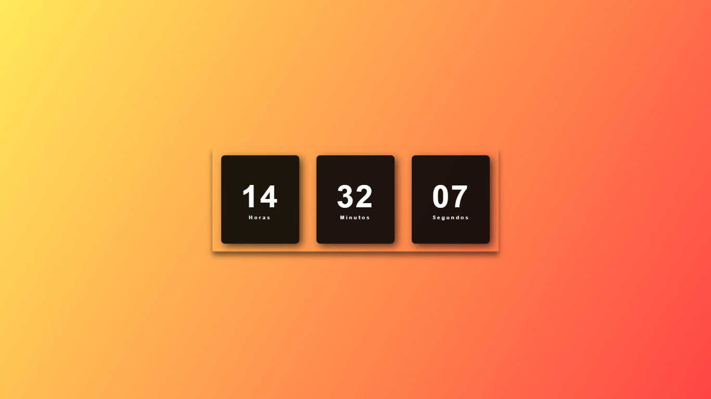

**Relógio Digital**

**Visão Geral**  
O projeto Relógio Digital é uma página web responsiva e otimizada para dispositivos móveis, projetada para exibir a hora atual de forma clara e acessível. A interface é otimizada para vários dispositivos, garantindo uma experiência contínua, seja em um smartphone, tablet ou desktop.

**Funcionalidades**

- **Design Mobile-First:** Desenvolvido com foco em dispositivos móveis, proporcionando uma experiência ideal em todos os tamanhos de tela.
- **Layout Responsivo:** Ajusta-se dinamicamente a diferentes resoluções de tela, garantindo que o relógio esteja sempre visível e legível.
- **Exibição da Hora Atual:** Mostra a hora atual em um formato limpo e fácil de ler.

<a href="https://vinicius-rodriguess.github.io/Digital-Clock/">Clique aqui para testar o projeto!</a>

**Digital Clock**

**Overview**  
The Digital Clock project is a mobile-first, responsive web page designed to display the current time in a clear and accessible format. The interface is optimized for various devices, ensuring a seamless experience whether you're on a smartphone, tablet, or desktop.

**Features**

- **Mobile-First Design**: Developed with a focus on mobile devices, providing an optimal experience across all screen sizes.
- **Responsive Layout**: Adjusts dynamically to different screen resolutions, ensuring the clock is always visible and legible.
- **Current Time Display**: Shows the current time in a clean, easy-to-read format.

<a href="https://vinicius-rodriguess.github.io/Digital-Clock/">Click here to test the project!</a>
